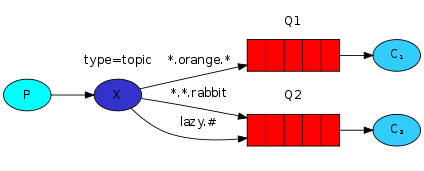

# RabbitMQ

[TOC]

## RabbitMQ概念

```markdown
Message Queue(MQ)是一种应用程序对应用程序的通信方法。RabbitMQ只是实现MQ的一种中间件，其他的还是有ActiveMQ,Kafaka和RocketMQ等消息中间件。
RabbitMQ中有Producer和consumer.producer用来生产消息，consumer用来处理或者说是消费消息。
consumer关注指定名称的queue来接收消息，consumer通过直接给队列消息或者交给exchange来发送消息给特定队列
```


## RabbitMQ服务器搭建

> RabbitMQ是用[portainer](https://www.portainer.io/)`一个搭建在docker容器中，用于管理容器的网站`中RabbitMQ服务器的模板来搭建的。
>
> + 启用RabbitMQ后台管理插件
>
> ```shell
> # 网站url为http://172.17.0.5:15672/ 账号密码都为guest
> rabbitmq-plugins enable rabbitmq-management
> ```
>
> + 启动stomp插件用来支持websocket连接
>
> ``` shell
> # 启用websocket
> rabbitmq-plugins enable rabbitmq_web_stomp
> # 启用websocket Demo URL为http://172.17.0.5:15670/
> rabbitmq-plugins enable rabbitmq_web_stomp_examples
> ```

## [RabbitMQ Tutorials](http://www.rabbitmq.com/getstarted.html)

### 1. Hello World


> producer直接将消息发送到consumer关注的队列中

### 2. Work Queues


> 两个consumer同时关注一个队列，producer将消息发送到队列，队列会将这些消息均匀的发送给两个consumer

> tutorial `1`和`2` 都不会将消息复制，只是将消息分发。

### 3. Publish/Subscribe


> 此时，在consumer和队列之间引入了`X`，`X`代表exchange。producer将消息发送给exchange，让exchange来发送这些消息到指定的队列中。这些队列需要绑定到exchange中。
>
> exchange有4种类型:direct，topic，headers和fanout。
>
> 这个tutorial用的fanout类型的exchange，此类型的exchange会将接收的一个消息广播到所有bind该exchange的队列中。

> The core idea in the messaging model in RabbitMQ is that the producer never sends any messages directly to a queue.Actually, quite often the producer doesn't even know if a message will be delivered to any queue at all.

### 4. Routing


> 这个tutorial是direct类型的exchange。此类型的exchange会将接收的一个消息发送给binding key和routing key相等的队列。binding key是队列与exchange绑定时提供的key，一个队列可以绑定多个binding key。routing key是producer发送消息给exchange时提供的key，一个消息只有一个routing key。

> 或者更简单的说，队列在绑定exchange是会给自己贴上一个或者多个标签，说明一下自己需要什么标签的消息。
>
> producer发送消息到exchange时会提供一个标签，exchange根据这个标签查找绑定自己的队列中有此标签的队列，然后将消息发送给这或这些队列

### 5. Topics



> 这个tutorial说明topic类型的exchange
>
> producer发送一个消息和一个routing key给`topic`exchange，队列绑定到`topic`exchange时会提供一个或者binding key，exchange在接收消息后，根据routing key查找队列中routing key能够匹配binding key的队列，发送这条消息给队列。

> 简单来说就是，队列绑定`topic`exchange时会提供一个或者多个匹配模式，producer发送一个消息时，也发送一个固定字符串，exchange根据队列中多个模式匹配这个字符串，将消息发送给模式匹配字符串的队列

> 图中Q1 routing key为`*.orange.*`，Q2 routing key为`*.*.rabbit`和`lazy.*`
>
> binding key为`lazy.orange.elephant`时，会将消息发送给Q1和Q2
>
> binding key为`lazy.red.rabbit`时，会将消息发送给Q2一次
>
> routing key和binding key是用`.`做为分词标记。`*`代表一个单词，`#`代表0个或者更多个单词

### 6. Remote procedure call(RPC)

> 暂无数据

## ~~RabbitMQ~~

> 正如RabbitMQ所说的，`RabbitMQ is a message broker: it accepts and forwards messages. You can think about it as a post office: when you put the mail that you want posting in a post box, you can be sure that Mr. or Ms. Mailperson will eventually deliver the mail to your recipient. In this analogy, RabbitMQ is a post box, a post office and a postman.` 
>
> 队列只是一个post box，并且会分发mail给用户。exchange是一个邮局，可以复制mail并将mail根据用户提供的地址发送给post box


[Rabbit tutorials](http://www.rabbitmq.com/getstarted.html),[Java Demo](https://github.com/ice-kumangcao/JavaDemo/tree/master/src/main/java/rabbitmq) 