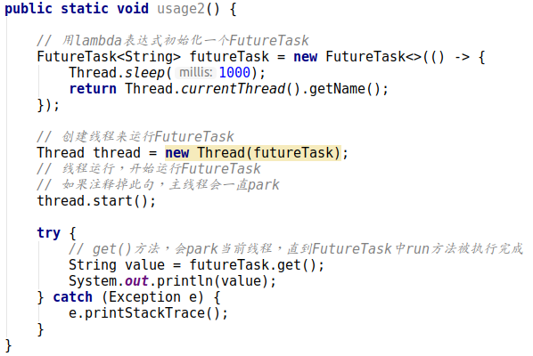

[TOC]

#### Future简介

``直接引用了Future接口的注释``

FutureTask是一个Future接口的实现，FutureTask同时实现了Runnable接口，FutureTask其实是对其属性callable的监控类。callable的状态记录在state属性中，callable的返回结果在outcome中，runner记录运行FutureTask.run方法的线程，waiters记录运行FutureTask.get方法的线程。

#### Code

#### FutureTask 类图

FutureTask实现了Runnable 和 Future 接口

#### FutureTask.run()

FutureTask.run方法在Thread运行时调用，run方法先判断了runner是否为空，如果为空则把当前线程做为FutureTask的Runner，判断方法是用了Unsafe类中compareAndSwapObject方法(直接操作内存，进行比较交换)。然后运行Callable中的call方法获取返回值，然后用set(result)修改state状态，设置结果值，

然后通过finishCompletion来恢复等待链表中线程(这个线程会在FutureTask.awaitDone中提到)的运行。

#### FutureTask.get

``下面所说的完成不等于程序正常运行成功返回结果，而是大于COMPLETIMG，FutureTask.run方法不在运行，即算完成``

FutureTask.get查看运行状态，如果还没有完成执行awaitDone，如果已经完成了，则直接通过report方法返回

#### FutureTask.awaitDone

timed用来判断是否设置了超时时间，执行FutureTask.get()方法是没有设置超时时间的，所以我直接默认timed为false。timed为ture或者为false,差别只是在LockSupport park的时间而已。

先判断state状态，如果大于COMPLETING说明已经完成了，直接返回。如果等于COMPLETING，说明程序还在运行，将线程从执行状态改为就绪状态，让掉自己的cpu。

然后对waiters进行赋值，waiters是运行get方法的线程链表

最后执行LockSupport.park方法挂起当前线程（在finishCompletion恢复），直到FutureTask.run方法执行完成恢复等待的线程。