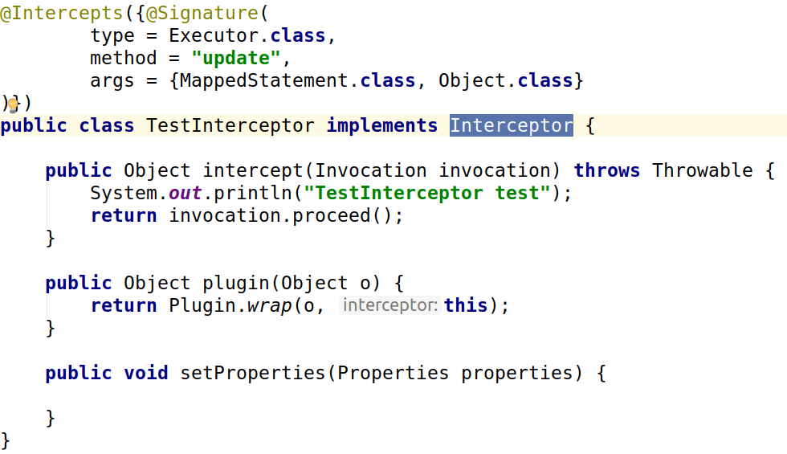
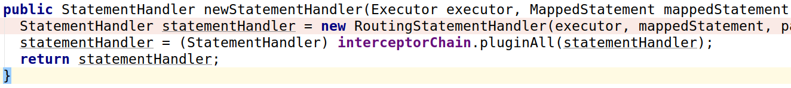

[TOC]

## mybatis plugin

mybatis是用层层代理来实现的，实现代码

Demo代码：<https://github.com/ice-kumangcao/springboot/tree/master/mybatis>

mybatis可以定义一个拦截器

mybatis是用层层代理来实现的，实现代码

mybatisplus 注入主键id是在初始化ParameterHandler时注入的，在 executor.update之后，（注意代理类有毒）

mybatis 拦截器 会代理executor对象，以及StatementHandler对象

// TODO: 待像更深层次挖掘，