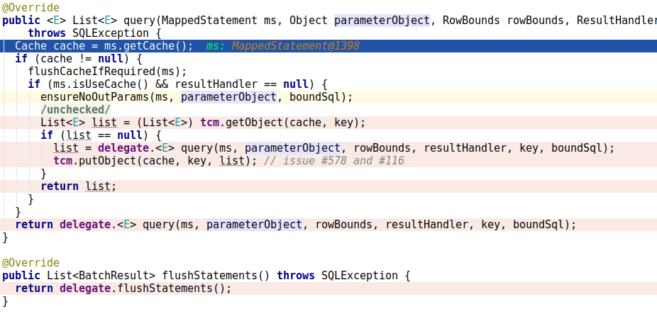

[TOC]

## mybatis简介

````
MyBatis is a first class persistence framework with support for custom SQL, stored procedures and advanced mappings. 
MyBatis eliminates almost all of the JDBC code and manual setting of parameters and retrieval of results. 
MyBatis can use simple XML or Annotations for configuration and map primitives, Map interfaces and Java POJOs (Plain Old Java Objects) to database records.
````
debug版本:**mybatis:3.4.5**
### 自我理解

mybatis代理Dao类，当运行Dao中方法时，根据方法查找相应的sql，然后去执行sql，来提供返回值。

## 初始化

##  一级缓存和二级缓存

### 程序主函数


因为mybatis采用的JDK反向代理，来代理Dao类。如果你想看代理Dao类具体实现，可以用一下方式

````shell
# idea打断点，查找运行java程序的pid
# 管理员身份运行jdk中sa-jdi.jar 主函数sun.jvm.hotspot.HSDB，来attach 那个pid
# 就可以查看Java程序运行到断点处的状态了，查找代理类
# JDK代理方法，命名为 $Proxy + 数字，不好查找，可以在断点前，输出代理类的名字
sudo java -classpath './jdk1.8.0_172/lib/sa-jdi.jar' sun.jvm.hotspot.HSDB
````

代理Dao类，主要运行了MapperProxy.invoke方法


Object.class.equals(method.getDeclaringClass()) 用来判断是否调用的是Object.class中方法，

isDefaultMethod(method) 用来判断是否是Java8中Interface 中新特性default修饰的方法，


MapperMethod.execute

判断执行的是insert，update，delete，select，flush中的哪一个，insert，update，delete返回的都是影响的行数，select才需要特殊处理返回数据，至于flush是执行有@Flush注解的方法是才去执行。


CachingExecutor.query

mybatis的二级缓存，缓存在Configuration中。

二级缓存是默认关闭的，设置需要在Mapper XML中添加cache配置。

二级缓存的返回是一个NameSpace 下一个缓存



BaseExecutor.query

mybatis一级缓存，缓存在SqlSession中。

一级缓存是默认的，不需要配置，localCache中没有缓存时，才去执行queryFromDatabase方法，去查询数据库，并将结果缓存到localCache中。


## 返回数据处理

