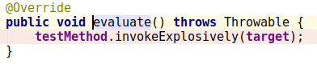

[TOC]

## Spring 5.0.2 + Junit4

环境:maven,idea 2018.2.2,jdk1.8,Linux

### 1. Test函数

````java
@RunWith(SpringJUnit4ClassRunner.class)
@ContextConfiguration(locations = {"/WEB-INF/spring-mvc.xml"})
public class SpringTest {
    @Autowired
    private ApplicationContext applicationContext;
    @Before
    public void before() {
        System.out.println("before");
    }
    @Test
    public void test() {
        String[] beanNames = applicationContext.getBeanDefinitionNames();
        for (String beanName : beanNames) {
            Object bean = applicationContext.getBean(beanName);
            System.out.println(beanName + " : " + bean);
        }
    }
    @After
    public void after() {
        System.out.println("after");
    }
}
````

### 2. 查找程序入口
添加断点进行debug，点击Debug工具中Get Thread dump 得到当前的函数栈


从函数栈中得到主函数在intellij中的JunitStarter中，但是这些源码在intellij中无法找到，所以只能从JUnitCore函数开始分析spring-junit的执行流程。

### 3. JUnitCore.run(Runner runner)


### 4. ParentRunner.run(final RunNotifier notifier)


#### 1) classBlock(notifier)

> Tips: Shife + 左击 在idea中会判定进入当前类的方法，不能进入`Override`此方法的子类。导致了认为`withBeforeClasses`生成了`RunBefores`,但是在`SpringJUnit4ClassRunner`子类中重写了`withBeforeClasses`，所以在`withBeforeClasses`是会生成`RunBeforeTestClassCallbacks`对象

`classBlock`函数会用`childrenInvoker`将notifier封装成为一个statement，这个statement是匿名的，用于处理`@Before`,`@After`,`@Test`等注解的函数，statement的实现如下:


在根据test函数中的`@BeforeClass`，`@AfterClass`和`@ClassRule`注解的函数生成`RunBeforeTestClassCallbacks+RunBefores`，`RunAfterTestClassCallbacks+RunAfters`和`RunRules`对象，并串成一个Statement链表.


#### 2) statement.evaluate()

此时statement为:


调用Statement链表的头元素的evaluate方法，会运行`@BeforeClass`,`@AfterClass`等注解的函数和`ParentRunner`中`childrenInvoker`的statement匿名函数。

`ParentRunner.childrenInvoker`的statement匿名函数运行主要函数如下:


> `methodBlock`和`ParentRunner` 中 `classBlock`相似，`methodBlock`是将`@Before`，`@After`，`@Test`等注解的方法生成`RunBeforeTestMethodCallbacks+RunBefores`，`RunAfterTestMethodCallbacks+RunAfter`和`InvokeMethod`等statement对象。
>
> `runLeaf`会执行这个statement链表。

下面提供了三种Statement evaluate方法：

##### (1) RunAfters.evaluate()

after在执行下一个statement evaluate方法之后，在执行当前方法。@After函数在此执行


##### (2) RunBefores.evaluate()

before在执行完成当前方法之后，在执行下一个statement evaluate方法。@Before函数在此执行


##### (3) InvokeMethod.evaluate()

此方法用于执行@Test函数


