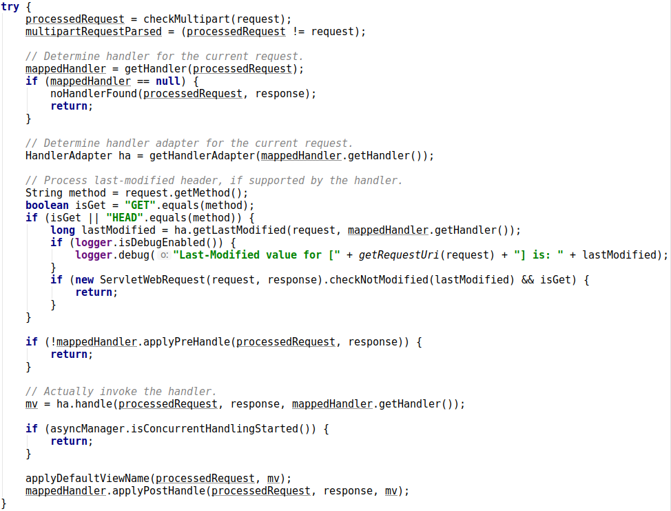
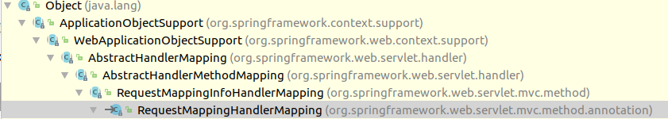

[TOC]

## Spring MVC 5.0.2框架

### web.xml

```xml
<!-- contextLoaderListener初始化数据 -->    
<context-param>
    <param-name>contextConfigLocation</param-name>
    <param-value>WEB-INF/spring-mvc.xml</param-value>
</context-param>
<listener>
    <listener-class>org.springframework.web.context.ContextLoaderListener</listener-class>
</listener>
<servlet>
    <servlet-name>main</servlet-name>
    <servlet-class>org.springframework.web.servlet.DispatcherServlet</servlet-class>
    <!-- main Servlet初始化数据，默认文件为main-Servlet.xml -->
    <init-param>
        <param-name>contextConfigLocation</param-name>
        <param-value>WEB-INF/spring-mvc.xml</param-value>
    </init-param>
    <load-on-startup>1</load-on-startup>
</servlet>
<servlet-mapping>
    <servlet-name>main</servlet-name>
    <url-pattern>/</url-pattern>
</servlet-mapping>
```
### ContextLoaderListener

ContextLoaderListener类实现是初始化ContextLoader中属性context。

> ContextLoader.java 中initWebApplicationContext函数负责了context的初始化 。
>
> 第一步：会查询ServletContext中是否已经有WebApplicationContext实例。
>
> 
>
> 第二步：如果context为空则初始化一个ConfigurableWebApplicationContext，设置Parent，然后进行configure，将这个实例保存到ServletContext中。关于接下来的ClassLoader操作，大概是判断当前线程是否是与ContextLoader由同一个类加载器加载，如果是的话，将context赋值给currentContxt，如果不是，则查看当前进程是否由Bootstrap加载，如果是则放到currentContextPerThread中。
>
> ```
> 当一个类的ClassLoader为空时，说明这个类是由Bootstrap加载的。
> ```
>
> 

### DispatcherServlet

DispatcherServlet类的继承关系图


由图可知，DispatcherServlet继承了GenericServlet，GenericServlet是实现了Servlet接口，Servlet定义了统一的方法，init(ServletConfig config)定义对Servlet初始化，destroy()对Servlet进行销毁，service（ServletReqeust req, ServletResponse res）是处理请求的方法。


#### DispatcherServlet init

~~大致进行了bean的初始化，以及WebApplicationContext的初始化~~

#### DispatcherServlet service

DispatcherServlet处理请求时，会调用DispatcherServlet.doService()函数来处理。

doService函数会保存一个attribute的Snapshot，然后在request设置一些attribute，执行doDispatch()函数来处理请求，最后根据Snapshot复原attribute。


##### doDispatch()



###### HandlerMapping HandlerAdapter

> getHandler查找DispatcherServlet中handlerMappings中的能够处理request中url的Handler，当有一个url被多次注册时，返回第一个能够处理url的Handler。HandlerMapping 有一下三种实现方式，这三种实现方式也代表了三种不同的注册url方式。
>
> RequestMappingHandlerMapping.java 通过 注解注册 url
>
> 
>
> BeanNameUrlHandlerMapping.java 通过beanName 注册 url
>
> 
>
> SimpleUrlHandlerMapping.java 通过配置SimpleUrlHandlerMapping中mappings
>
> 
>
> RequestMappingHandlerMapping 继承于AbstractHandlerMethodMapping,
>
> BeanNameUrlHandlerMapping 和 SimpleUrlHandlerMapping 继承于AbstractUrlHandlerMapping.
>
> AbstractHandlerMethodMapping 和AbstractUrlHandlerMapping 在 getHandlerInternal 函数实现上不同，getHandlerInternal 用来查找handler. AbstractHandlerMethodMapping将映射存储在mappingRegistry中registry里，存储url对应的处理方法。AbstractUrlHandlerMapping将映射存储在handlerMap，存储url对应的类。

> getHandlerAdapter用来能够支持handler的HandlerAdapter.
>
> HandlerAdapter有以下四种实现类
>
> SimpleServletHandlerAdapter.java support handler instanceof Servlet，处理方法是将handler转换为Servlet执行service方法。
>
> 
>
> SimpleControllerHandlerAdapter.java support handler instanceof Controller，处理方法是将handler转为为Controller ，执行handlerRequest方法。
>
> 
>
> HttpRequestHandlerAdapter.java 同 SimpleControllerHandlerAdapter.java
>
> 
>
> AbstractHandlerMethodAdapter.java  支持 handler instanceof HandlerMethod，supportsInternal由子类判断。
>
> RequestMappingHandlerAdapter实现的supportInternal方法默认返回true。
>
> 
>
> SimpleServletHandlerAdapter，SimpleControllerHandlerAdapter，HttpRequestHandlerAdapter，这三种处理的是类(由AbstractUrlHandlerMapping生成),处理方式是转换类型，执行特定方法。
>
> AbstractHandlerMethodAdapter 处理 由AbstractHandlerMethodMapping 生成的HandlerMethod.处理方式是通过反射invoke，执行方法，返回结果值。
>
> ```
> 关于HandlerMapping,HandlerAdapter HandlerMapping中存储着url -> method/class的映射，从HandlerMapping中找到url映射的method/class,然后在HandlerAdapter中查找能够处理这个method/class，处理的方式大概有两种，如果handler为class，强制类型转换，然后执行特定的方法。如果handler为method，利用反射invoke。
> ```

###### RequestMappingHandlerAdapter 处理方法


> getMethodArgumentValues完成了对method方法的参数的配置
>
> doInvoke执行方法返回结果值

#### DispatcherServlet destory

